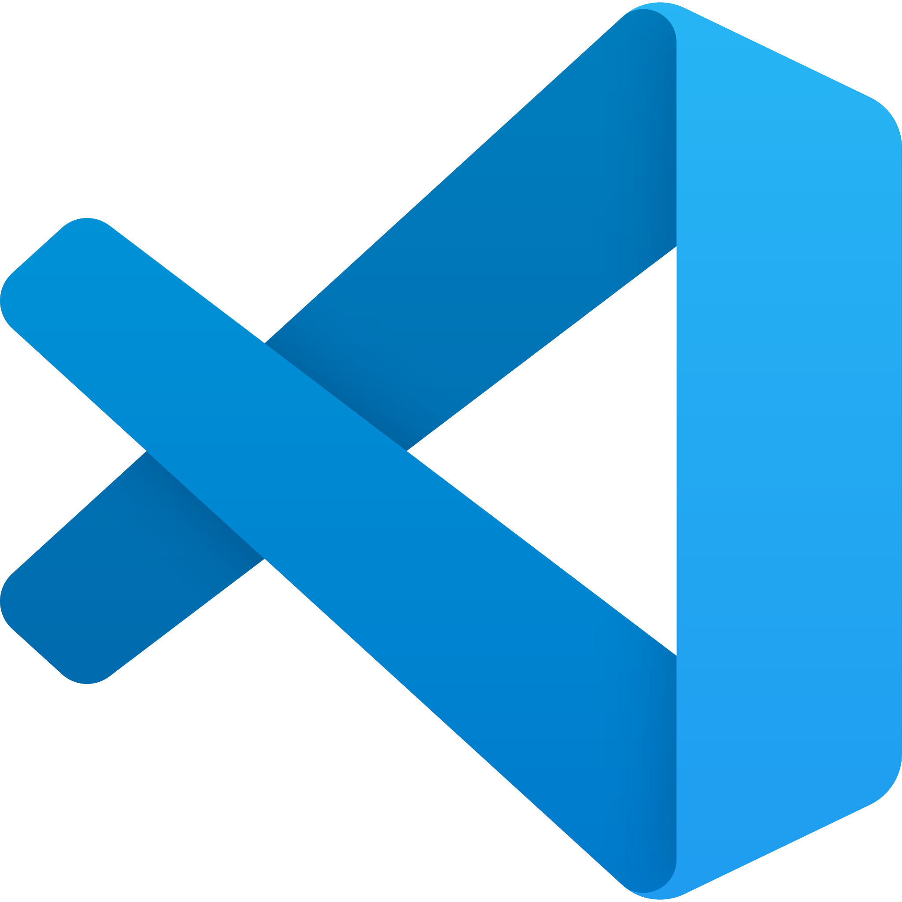

# Windows Shortcut Cheat Sheet

  
  &nbsp;&nbsp;&nbsp;
  

Keyboard shortcuts are not a productivity trick — they're how you stop losing your train of
thought. Every trip to the mouse costs you a second and a little bit of focus, and you make
that trip a few hundred times a night. Keep this open; you're not expected to memorize it.

> **On a Mac?** There's a [Mac shortcut cheat sheet](mac-shortcuts-cheat-sheet.md) written for
> you. Nearly everything below also works with **`Cmd`** where this page says `Ctrl` — the
> [Mac differences](#if-youre-on-a-mac) section covers the handful that don't map cleanly.

## If you learn only five

Start here. These five come up constantly in class, and the last one saves people the most
frustration by a wide margin.

| Shortcut | What it does |
|---|---|
| `Alt` + `Tab` | Switch between open windows |
| `Win` + `Left` / `Right` | Snap the current window to half the screen |
| `Win` + `Shift` + `S` | Screenshot a region — perfect for asking for help |
| `Ctrl` + `` ` `` | Open/close the terminal in VS Code |
| `Ctrl` + `Shift` + `R` | Hard refresh the browser — *load my actual changes* |

**Click any section to jump to it:**
[Windows key](#the-windows-key) ·
[Windows and desktops](#managing-windows-and-desktops) ·
[Text editing](#text-editing-everywhere) ·
[File Explorer](#file-explorer) ·
[Browser](#the-browser) ·
[Terminal](#the-terminal) ·
[VS Code](#vs-code) ·
[Mac differences](#if-youre-on-a-mac)

---

## The Windows key

The `Win` key is the one with the Windows logo, between `Ctrl` and `Alt` on the bottom left.
On its own it opens the Start menu — and you can just **start typing** to find an app instead
of hunting for its icon.

| Shortcut | What it does |
|---|---|
| `Win` | Start menu — then type an app name and press `Enter` |
| `Win` + `E` | Open File Explorer |
| `Win` + `D` | Show the desktop (press again to bring everything back) |
| `Win` + `L` | Lock your screen |
| `Win` + `X` | Power-user menu — Terminal, Settings, Device Manager |
| `Win` + `I` | Open Settings |
| `Win` + `V` | **Clipboard history** — everything you've copied recently |
| `Win` + `.` | Emoji and symbol picker |
| `Win` + `Shift` + `S` | Screenshot a region you drag over |
| `Win` + `1` … `9` | Jump to the app pinned in that taskbar slot |

**Two worth setting up on purpose:**

**`Win` + `V`** is off until you turn it on. Press it once and Windows offers to enable
clipboard history — say yes. From then on it remembers your last several copies, which means
copying a second thing no longer destroys the first. Anyone who has copied a URL, then copied
a command, then needed the URL again knows why this matters.

**`Win` + `Shift` + `S`** puts a cropped screenshot on your clipboard, ready to paste into
Teams, an email, or an AI assistant. This is the fastest way to show someone an error message.
When you're stuck, a screenshot of the *whole* window — code, terminal, and error together —
gets you a useful answer far faster than a cropped screenshot of just the red text.

> Prefer a file on disk? `Win` + `PrtScn` saves a full-screen shot to
> `Pictures\Screenshots` automatically.

---

## Managing windows and desktops

You'll routinely have an editor, a browser, and a terminal fighting over the same screen.
Snapping beats dragging windows by hand.

| Shortcut | What it does |
|---|---|
| `Alt` + `Tab` | Switch windows — hold `Alt` and tap `Tab` to go further back |
| `Win` + `Tab` | Task View — every window and desktop, laid out |
| `Win` + `Left` / `Right` | Snap the window to that half of the screen |
| `Win` + `Up` | Maximize |
| `Win` + `Down` | Restore, then minimize |
| `Win` + `Z` | Snap Layouts — pick a split from the grid (Windows 11) |
| `Alt` + `F4` | Close the current window |
| `Win` + `Ctrl` + `D` | Create a new virtual desktop |
| `Win` + `Ctrl` + `Left` / `Right` | Switch between virtual desktops |
| `Win` + `Ctrl` + `F4` | Close the current virtual desktop |

**Why you use it:** `Win` + `Left` on VS Code and `Win` + `Right` on your browser gives you
code on one side and the running page on the other, in about a second. That side-by-side view
is most of front-end development — you change code, you look at the result, you repeat.

**Virtual desktops** are a second (and third) screen you don't have to buy. Put class work on
desktop 1 and everything else on desktop 2, and `Win` + `Ctrl` + `Left/Right` between them.
Your windows aren't closed, just out of the way.

---

## Text editing, everywhere

These work in your editor, your browser, Word, chat boxes — anywhere you can type. If you know
only the copy/paste three, the ones below the divider are where the real time goes.

| Shortcut | What it does |
|---|---|
| `Ctrl` + `C` / `X` / `V` | Copy / cut / paste |
| `Ctrl` + `Z` | Undo |
| `Ctrl` + `Y` | Redo (`Ctrl` + `Shift` + `Z` in most editors) |
| `Ctrl` + `A` | Select all |
| `Ctrl` + `S` | Save |
| `Ctrl` + `F` | Find on this page or in this file |
| | |
| `Ctrl` + `Left` / `Right` | Move the cursor one **word** at a time |
| `Home` / `End` | Jump to the start / end of the line |
| `Ctrl` + `Home` / `End` | Jump to the top / bottom of the document |
| `Shift` + any of the above | Do the same move, but **select** as you go |
| `Ctrl` + `Backspace` | Delete the word behind the cursor |
| `Ctrl` + `Shift` + `V` | Paste as plain text (drops formatting) |

**Why you use it:** holding `Shift` turns any movement into a selection. `Shift` + `End`
selects to the end of the line; `Ctrl` + `Shift` + `Left` grabs the previous word. Once that
clicks, you stop reaching for the mouse to select text, which is a surprising share of the
mousing you currently do.

> `Ctrl` + `Shift` + `V` is the one to remember when pasting into a doc, a form, or a chat —
> it strips the fonts, colors, and stray formatting that come along with copied text.

---

## File Explorer

| Shortcut | What it does |
|---|---|
| `Win` + `E` | Open a new File Explorer window |
| `Ctrl` + `Shift` + `N` | New folder |
| `F2` | Rename the selected file |
| `Alt` + `Up` | Go up to the parent folder |
| `Alt` + `Left` / `Right` | Back / forward, like a browser |
| `Ctrl` + `L` | Focus the address bar (`Alt` + `D` does the same) |
| `Ctrl` + `Shift` + `E` | Expand the sidebar tree to the folder you're in |

**Two Explorer tricks worth more than the shortcuts:**

**Turn on file extensions.** In Explorer, go to **View → Show → File name extensions**.
Windows hides them by default, which means `styles.css` and `styles.css.txt` look identical —
and a file that silently isn't what you think it is will cost you an evening. Turn this on
once, on day one.

**Open a terminal in the current folder.** Type `powershell` (or `cmd`) into the address bar
and press `Enter`, and you get a terminal already pointed at that folder. Shift + right-click
in empty space offers the same thing from the menu. This saves a lot of `cd` typing when
you're not sure of the exact path.

---

## The browser

You'll live in a browser as much as in your editor. These work in Chrome and Edge; Firefox is
nearly identical.

| Shortcut | What it does |
|---|---|
| `Ctrl` + `T` / `W` | New tab / close tab |
| `Ctrl` + `Shift` + `T` | **Reopen the tab you just closed** (repeat to go further back) |
| `Ctrl` + `Tab` | Next tab (`Ctrl` + `Shift` + `Tab` for previous) |
| `Ctrl` + `L` | Jump to the address bar and select it — then just type |
| `Ctrl` + `R` | Refresh |
| `Ctrl` + `Shift` + `R` | **Hard refresh** — reload ignoring the cache |
| `F12` | Open DevTools (`Ctrl` + `Shift` + `I` does the same) |
| `Ctrl` + `Shift` + `N` | New incognito / private window |
| `Ctrl` + `+` / `-` / `0` | Zoom in / out / reset |

**Why `Ctrl` + `Shift` + `R` matters:** browsers cache your CSS and JavaScript to make pages
load fast. That's helpful right up until you change a file, refresh, and see the *old* version
— at which point you assume your code is broken when it's fine. Hard refresh is the first
thing to try when a change doesn't show up. **`F12` and hard refresh will come up in class
every single week.**

---

## The terminal

Applies to PowerShell, Windows Terminal, Git Bash, and the terminal inside VS Code. A few
behave differently between shells; those are called out.

| Shortcut | What it does |
|---|---|
| `Ctrl` + `C` | **Stop** the command that's currently running |
| `Up` / `Down` | Walk back through commands you've already run |
| `Tab` | Auto-complete a file, folder, or command name |
| `Ctrl` + `R` | Search your command history by typing part of it |
| `Ctrl` + `L` | Clear the screen (`cls` in PowerShell, `clear` in Git Bash) |
| `Ctrl` + `A` / `E` | Jump to the start / end of the line *(Git Bash)* |
| `Ctrl` + `Shift` + `C` / `V` | Copy / paste *(Git Bash and Windows Terminal)* |

> **The gotcha that gets everyone:** in a terminal, `Ctrl` + `C` means **cancel**, not copy.
> If a server is running and your prompt won't come back, that's not frozen — it's working as
> designed. `Ctrl` + `C` stops it and gives you the prompt back. In Git Bash, use
> `Ctrl` + `Shift` + `C` when you actually want to copy.

**Why `Up` and `Tab` matter more than they look:** most terminal work is re-running a command
you ran two minutes ago, and `Up` a few times beats retyping it — with fewer typos. `Tab`
completes long folder names for you, which is also how you find out you're in the wrong
directory: if `Tab` won't complete the name, the thing you're typing isn't there.

---

## VS Code

VS Code has hundreds of shortcuts. These are the ones worth knowing in week one; you'll pick
up more as you need them.

| Shortcut | What it does |
|---|---|
| `Ctrl` + `` ` `` | Toggle the built-in terminal |
| `Ctrl` + `P` | Quick open — type part of a filename and hit `Enter` |
| `Ctrl` + `Shift` + `P` | **Command Palette** — search every command by name |
| `Ctrl` + `B` | Show/hide the sidebar |
| `Ctrl` + `/` | Comment or uncomment the selected lines |
| `Alt` + `Up` / `Down` | Move the current line up or down |
| `Shift` + `Alt` + `Up` / `Down` | Duplicate the current line |
| `Ctrl` + `D` | Select the next occurrence of what's selected — edit both at once |
| `Ctrl` + `Shift` + `F` | Search across every file in the project |
| `Shift` + `Alt` + `F` | Auto-format the file |
| `F2` | Rename a variable **everywhere** it's used |
| `Ctrl` + `K` `Ctrl` + `S` | Open the full keyboard shortcut list |

**The two that matter most:**

**`Ctrl` + `Shift` + `P`** is the answer to "how do I do X in VS Code?" Open it, type roughly
what you want, and the command shows up — along with its keyboard shortcut, which is how you
learn the rest of them over time. If you remember one shortcut from this section, this is it.

**`Ctrl` + `P`** finds a file by name in a project with hundreds of them, without touching the
file tree. Once a project outgrows a handful of files, this is how you navigate.

> `Ctrl` + `K` `Ctrl` + `S` is a **chord** — press `Ctrl` + `K`, let go, then press
> `Ctrl` + `S`. VS Code uses several of these. It's also the place to change any shortcut you
> don't like.

---

## If you're on a Mac

Most of this page works if you swap **`Ctrl` → `Cmd`** (`Cmd` + `C`, `Cmd` + `S`, `Cmd` + `P`,
and so on). The rest are below — and the [Mac shortcut cheat sheet](mac-shortcuts-cheat-sheet.md)
covers all of it properly, including the Mac-only things that have no Windows equivalent:

| Windows | Mac |
|---|---|
| `Alt` + `Tab` | `Cmd` + `Tab` |
| `Win` + `Left` / `Right` | Drag to the screen edge, or use Rectangle/Magnet |
| `Win` + `Shift` + `S` | `Cmd` + `Shift` + `4` |
| `Win` + `E` (File Explorer) | `Cmd` + `Space`, type "Finder" |
| `Ctrl` + `Shift` + `R` (hard refresh) | `Cmd` + `Shift` + `R` |
| `F12` (DevTools) | `Cmd` + `Option` + `I` |
| `Home` / `End` | `Cmd` + `Left` / `Right` |
| `Ctrl` + `Left` / `Right` (by word) | `Option` + `Left` / `Right` |
| `Ctrl` + `Backspace` (delete word) | `Option` + `Delete` |

`Ctrl` + `C` in a terminal is `Ctrl` + `C` on a Mac too — that one is `Ctrl`, not `Cmd`,
on every platform.

---

## How to actually learn these

Don't try to memorize the page. Pick **two** shortcuts you'd genuinely use, and force yourself
to use them for a week — even when reaching for the mouse would be faster in the moment. That
week is the whole cost; after it, they're automatic and free forever.

When you catch yourself doing something repetitive with the mouse, that's the signal to come
back here and look for the shortcut. That's the habit worth building — not the list.
